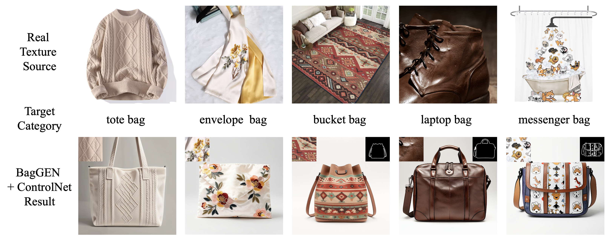

# BagGEN: An Engineered Approach towards High-Quality Bag Image Generation with Texture and Shape Control

[Technical Report](https://papers.ssrn.com/sol3/papers.cfm?abstract_id=6259845) | [ModelScope](https://www.modelscope.cn/models/musinghead/BagGEN) | [Hugging Face](https://huggingface.co/zhkuang/BagGEN) | [Dataset](https://modelscope.cn/datasets/musinghead/SynBag50K)

BagGEN is a fine-tuned IP-Adapter for texture-conditioned bag image generation. Given a texture patch from a reference image and a bag category description, it generates bag images guided by the reference texture and material appearance. BagGEN can optionally be combined with ControlNet, using a contour or scribble as an additional condition to guide the bag's structure.

This repository provides inference code, pretrained BagGEN weights through the model link above, and example inputs. The training method and synthetic data preparation pipeline are described in the technical report; training code is not included in this release.

| Model Input | Model Output |
| --- | --- |
| Texture patch <br> + bag category description<br>+ optional contour or scribble condition via ControlNet | A generated bag image guided by the input texture, category, and optional structure condition |



Sample results using texture patches extracted from real-world product images. Insets show the input texture patches and, where applicable, the contour or scribble conditions.

## Models to Download

Download the following models before running inference. ControlNet is required only when using a contour or scribble condition.

| Model | Download |
| --- | --- |
| BagGEN weights | [ModelScope](https://www.modelscope.cn/models/musinghead/BagGEN), [Hugging Face](https://huggingface.co/zhkuang/BagGEN) |
| SDXL Base 1.0 | [Hugging Face](https://huggingface.co/stabilityai/stable-diffusion-xl-base-1.0) |
| SDXL FP16 VAE | [Hugging Face](https://huggingface.co/madebyollin/sdxl-vae-fp16-fix) |
| IP-Adapter image encoder | [ModelScope](https://www.modelscope.cn/models/AI-ModelScope/IP-Adapter), [Hugging Face](https://huggingface.co/h94/IP-Adapter) |
| Scribble ControlNet for SDXL (optional) | [Hugging Face](https://huggingface.co/xinsir/controlnet-scribble-sdxl-1.0) |

- Use `ip-adapter_sdxl_vit-h_baggen.bin` as the BagGEN weight file.
- Use the ViT-H image encoder in `IP-Adapter/models/image_encoder`. The encoder in `sdxl_models/image_encoder` is a different model and is incompatible with these BagGEN weights.
- Use the external `sdxl-vae-fp16-fix` VAE to retain the numerical stability settings used in our experiments.
- The same Scribble ControlNet is used for both contour and scribble inputs.

All model arguments accept local paths. The script does not download models automatically. SDXL, VAE, image encoder, and ControlNet paths must point to their respective model directories, including configuration and weight files; the BagGEN path must point to the `.bin` weight file. For SDXL, use a Diffusers-format directory rather than a single checkpoint file.

## Environment Setup

The inference environment has been tested on Linux with an NVIDIA RTX 4090 GPU. The script uses a CUDA-enabled NVIDIA GPU and FP16 inference.

From the BagGEN directory, create the Python environment and install the dependencies:

```bash
conda env create -f environment.yml
conda activate baggen

python -m pip install torch==2.9.1 --index-url https://download.pytorch.org/whl/cu128
python -m pip install -r requirements.txt
```

These commands install the tested CUDA 12.8 build of PyTorch. Use an NVIDIA driver compatible with that build.

## Inference

### Input Preparation

Each run processes one set of inputs: a texture source image, a bag category description, and an optional structure image.

The script converts the texture source image to RGB, resizes its shorter side to 1024 pixels using LANCZOS resampling, takes a centered 1024×1024 crop, and then extracts its central 256×256 patch. Place the desired texture near the center of the source image. The script applies this preprocessing to every texture input, including images that are already cropped patches.

Supply the bag category using either `--property_json` or `--category`, but not both. A minimal property file is:

```json
{
  "category": "open tote bag"
}
```

Only the `category` field is used; other fields, such as `material` and `decorative_theme`, are ignored. The category is inserted into the following text prompt:

```text
A {category}, detailed, centered, high-quality, product photo, white background
```

For structure control, supply both `--controlnet_path` and `--structure_image_path`. The included contour and scribble examples are 1024×1024 images; use a similar format when preparing your own conditions.

### Main Arguments

| Pretrained Model Arguments | Description |
| --- | --- |
| `--sdxl_path` | Local directory containing SDXL Base 1.0 (required) |
| `--vae_path` | Local directory containing `sdxl-vae-fp16-fix` (required) |
| `--ip_adapter_weight_path` | Local path to the BagGEN `.bin` weight file (required) |
| `--image_encoder_path` | Local directory containing the ViT-H image encoder from `IP-Adapter/models/image_encoder` (required) |
| `--controlnet_path` | Local directory containing the SDXL Scribble ControlNet (optional; requires `--structure_image_path`) |

| Model Input Arguments | Description |
| --- | --- |
| `--texture_image_path` | Texture source image, processed into a central 256×256 patch |
| `--property_json` | JSON file containing a nonempty `category` string |
| `--category` | Bag category supplied directly as a string; an alternative to `--property_json` |
| `--structure_image_path` | Contour or scribble image (optional; requires `--controlnet_path`) |

By default, `infer_baggen.py` performs texture + category inference. Providing both `--controlnet_path` and `--structure_image_path` enables texture + category + structure inference.

| Generation and Output Arguments | Description |
| --- | --- |
| `--output_path` | Output directory; defaults to `results` beside the script |
| `--num_try` | Number of sequential generations from the same inputs; defaults to `5` |
| `--seed` | Optional base seed; generation `i` uses `seed + i`, starting at `i = 0`. No seed is fixed by default |
| `--num_inference_steps` | Number of sampling steps; defaults to `50` |
| `--guidance_scale` | Classifier-free guidance scale; defaults to `5.0` |
| `--ipadapter_conditioning_scale` | IP-Adapter conditioning scale; defaults to `1.0` |
| `--controlnet_conditioning_scale` | ControlNet conditioning scale; defaults to `1.0` |

Inference uses the Euler ancestral scheduler and produces 1024×1024 images. Only generated images are saved, named `result_000.png`, `result_001.png`, and so on. Reusing an output directory overwrites files with the same names, so use a separate directory for each run you want to retain.

To view all command-line options:

```bash
python infer_baggen.py --help
```

### Command Templates

Run these commands from the BagGEN directory. Replace the quoted `/path/to/...` placeholders with your downloaded models' local paths.

**Texture + category inference:**

```bash
CUDA_VISIBLE_DEVICES=0 python infer_baggen.py \
    --sdxl_path "/path/to/sdxl-base" \
    --vae_path "/path/to/sdxl-vae-fp16-fix" \
    --ip_adapter_weight_path "/path/to/ip-adapter_sdxl_vit-h_baggen.bin" \
    --image_encoder_path "/path/to/IP-Adapter/models/image_encoder" \
    --texture_image_path assets/real_patch_assets/texonly_0000/tex_source.png \
    --property_json assets/real_patch_assets/texonly_0000/property.json \
    --output_path results/texonly_0000
```

To supply the category directly, replace `--property_json ...` with `--category "open tote bag"`.

**Texture + category + contour inference:**

```bash
CUDA_VISIBLE_DEVICES=0 python infer_baggen.py \
    --sdxl_path "/path/to/sdxl-base" \
    --vae_path "/path/to/sdxl-vae-fp16-fix" \
    --ip_adapter_weight_path "/path/to/ip-adapter_sdxl_vit-h_baggen.bin" \
    --image_encoder_path "/path/to/IP-Adapter/models/image_encoder" \
    --controlnet_path "/path/to/controlnet-scribble-sdxl-1.0" \
    --structure_image_path assets/real_patch_assets/contour_0002/contour.png \
    --texture_image_path assets/real_patch_assets/contour_0002/tex_source.png \
    --property_json assets/real_patch_assets/contour_0002/property.json \
    --output_path results/contour_0002
```

**Texture + category + scribble inference:**

```bash
CUDA_VISIBLE_DEVICES=0 python infer_baggen.py \
    --sdxl_path "/path/to/sdxl-base" \
    --vae_path "/path/to/sdxl-vae-fp16-fix" \
    --ip_adapter_weight_path "/path/to/ip-adapter_sdxl_vit-h_baggen.bin" \
    --image_encoder_path "/path/to/IP-Adapter/models/image_encoder" \
    --controlnet_path "/path/to/controlnet-scribble-sdxl-1.0" \
    --structure_image_path assets/real_patch_assets/scribble_0004/scribble.png \
    --texture_image_path assets/real_patch_assets/scribble_0004/tex_source.png \
    --property_json assets/real_patch_assets/scribble_0004/property.json \
    --output_path results/scribble_0004
```

Append `--seed 42` to set a base seed or `--num_try 1` to generate a single image.

## Training Method

BagGEN follows a fine-tuning approach based on the original [IP-Adapter](https://github.com/tencent-ailab/IP-Adapter): the image projection module and image-conditioned attention parameters are trained, while the SDXL backbone and image encoder remain frozen. ControlNet is used at inference time to provide optional structure guidance.

The [technical report](https://papers.ssrn.com/sol3/papers.cfm?abstract_id=6259845) describes the preparation of the [SynBag50K](https://modelscope.cn/datasets/musinghead/SynBag50K) synthetic dataset, the fine-tuning procedure, and the experimental evaluation. This release focuses on inference; refer to the report for the training methodology.

## Limitations

The synthetic training data was generated using the bag categories, decorative themes, and materials listed in [assets/bag_prompt_info.json](assets/bag_prompt_info.json). Performance may vary for categories and texture appearances that are poorly represented in the training data.

BagGEN guides the overall texture and material appearance of the generated bag. It may reinterpret decorative motifs rather than reproduce them exactly. The real-image examples illustrate the model's behavior on a small representative set of inputs.

## Citation

```bibtex
@article{kuang6259845baggen,
  title={BagGEN: An Engineered Approach towards High-Quality Bag Image Generation with Texture and Shape Control},
  author={Kuang, Zhiyi and Zheng, Youyi},
  journal={Available at SSRN 6259845},
  year={2026},
  url={https://papers.ssrn.com/sol3/papers.cfm?abstract_id=6259845}
}
```
